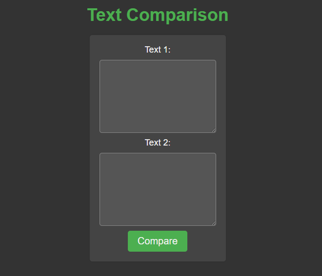

# Text Comparison Tool

 

## Description
This is a web application that allows users to compare two texts and see whether they are identical or different. The app is built with HTML, CSS, and JavaScript.
 

## Usage
To use the app, simply enter two texts in the provided text fields and click the "Compare" button. The app will then compare the texts and display the result in the result field. If the texts are identical, the result field will display "The texts are identical" in green. If the texts are different, the result field will display "The texts are different" in red.

## Installation
To use the app locally, simply download the files and open the index.html file in your web browser.
